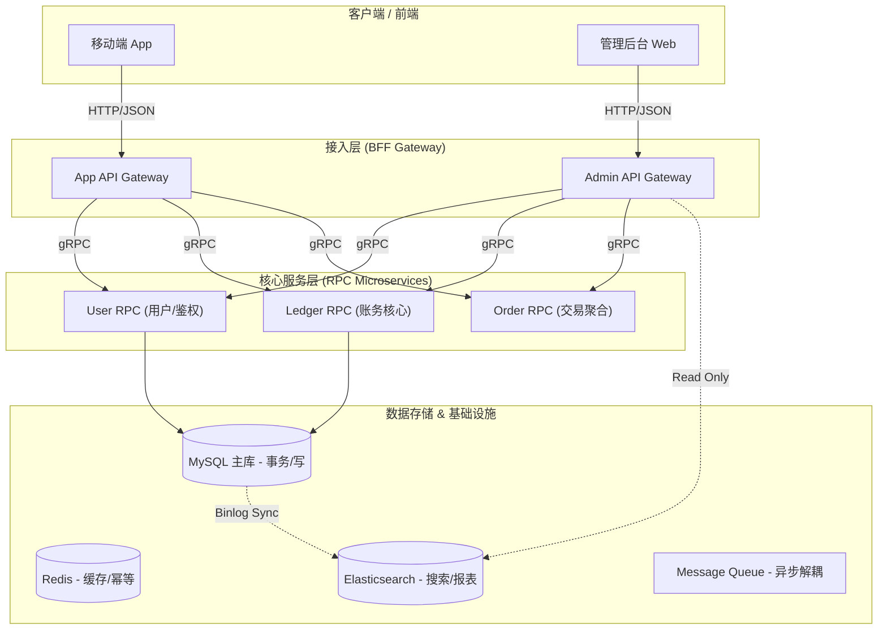

# 系统架构设计方案 (V1.0)
## 1. 总体架构概览
本系统采用 微服务架构，基于 BFF (Backend for Frontend) 模式与 DDD (领域驱动设计) 思想。核心目标是实现高内聚、低耦合、数据强一致性（账务核心）与查询高性能（搜索核心）。

### 1.1 系统拓扑图

## 2. 核心分层设计原则
### 2.1 分层职责详解
| 层级 | 组件名称 | 核心职责 | 禁止行为 |
| --- | --- | --- | --- |
| 接入层 | BFF (API) | 1. 鉴权 (JWT 解析) 2. 参数校验 (格式) 3. 数据组装 (聚合多个 RPC 结果) 4. 协议转换 (HTTP -> gRPC) | ❌ 直接连接 MySQL❌ 开启数据库事务❌ 包含核心业务计算逻辑 |
| 服务层 | RPC Server | 1. 业务逻辑 (UseCase/Domain) 2. 事务控制 (ACID) 3. 权限校验 (归属权/数据所有权) 4. 防腐层设计 | ❌ 直接返回 DB Model 给 BFF (必须转 Proto)❌ 处理 HTTP 协议细节 |
| 数据层 | Repository | 1. SQL 语句封装 2. Redis 操作 3. 数据实体映射 | ❌ 包含业务判断 (如余额是否充足) |

### 2.2 关键铁律
- 写操作死守 RPC： 所有的 Create/Update/Delete 必须经过 RPC 服务。
- BFF 不碰主库： BFF 只能持有 RPC Client 和 Redis/ES Client，绝不可导入 SQL Driver。
- 充血模型： RPC 服务不仅仅是 CRUD，必须包含业务意图（如 RevertTransaction 而非 DeleteTransaction）。